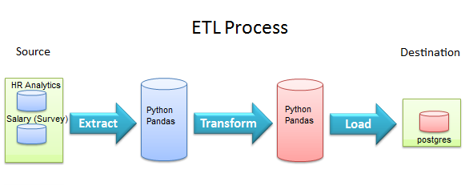
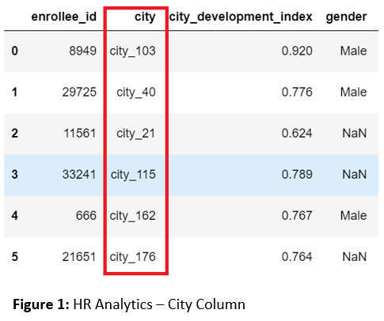
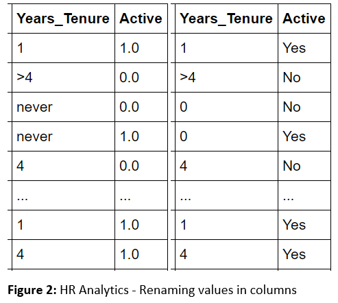
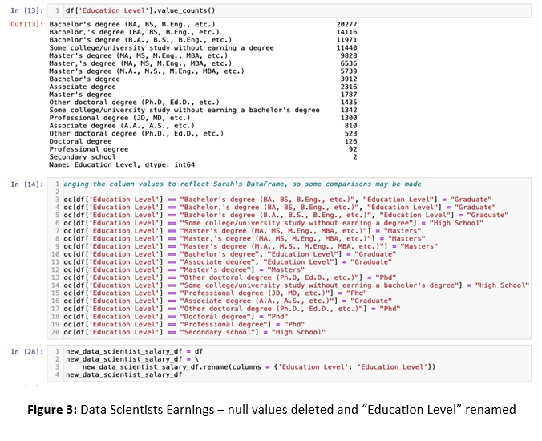
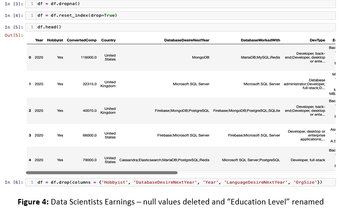
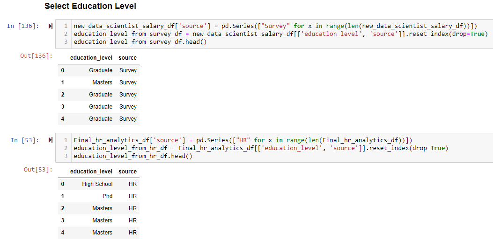
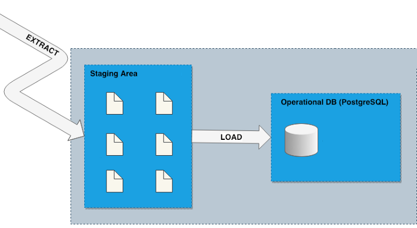
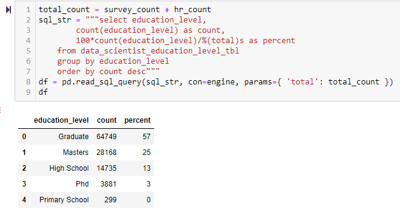

# `ETL Project: Data Scientist Jobs`

## Project Proposal
In our project we took two datasets from Kaggle, “How much do data scientists earn in 2017-2020,” and “HR Analytics: Job Change of Data Scientists” and extracted/transformed the data via Jupyter Notebook, set up our tables with pgAdmin and finally loaded the data into postgres.

## Report

### Extract:
We used two datasets from Kaggle, “How much do data scientists earn in 2017-2020,” and “HR Analytics.”
- How much do data scientists earn in 2017-2020 – is a survey that evaluates the impact different variables have on the expected salary of data scientists in the international market.

- HR Analytics – gauges the factors that lead an employee to leave a current job, including education, experience, and company loyalty.

### Transformation:
Our first steps in cleaning up the datasets included learning the definition of each variable and deciding whether it was relevant. An example of this was in the HR Analytics dataset, where “City” was coded by city, but the code was not defined.

We found that in the database HR Analytics the column for length of time at their current job was labeled “never” if it was a new job, less than a year. We changed “never” to “0.”
Additionally, in the actively searching for a new job column, 1.0 and 0.0 was used to represent “Yes” and “No” respectively. We changed the values of the “Active” column for ease of readability.

Similarly, the Data Scientist Salary dataset was transformed in several steps. First, any null values were deleted, which still left a more than sizable dataset to analyze at a later point. Then, certain columns were renamed, both for clarity, and the “Education Level” column that occurred in both datasets were renamed to match each other. Then, steps were taken to change the values in the column “Education Level” in the Salary dataset to match those of the HR Analytics dataset. Thus, “Bachelor’s degree” in the Salary dataset became “Graduate,” and so on.

We generated another table for each dataset with the common column, which is education level per data scientist. We also added a column named "source", that will be "Survey" for the Data Scientist Salary dataset and "HR"for the HR Analytics dataset.

## Load:

The ultimate goal of an extract, transform, and load (ETL) process is to store data in a permanent location. This is usually an operational database or data warehouse. We used a relational database, PostgreSQL, to append the records from both education level dataframes into a single postgres table.

Usage: postgres must be locally operational (localhost:5432) and a database data_scientist_DB must have been previously created with the corresponding data_scientist_education_level_tbl. A valid password in config.py file is also needed.

Finally, we obtained from postgres a summary table with typical education level for data scientists.

## Team Members:

- Sarah Klein
- Luis Rojas
- Jimmy White

## Links
- [JWhiteAnalytics.com](https://jwhiteanalytics.com)
- [LinkedIn](https://www.linkedin.com/in/jimmywhite1987)
